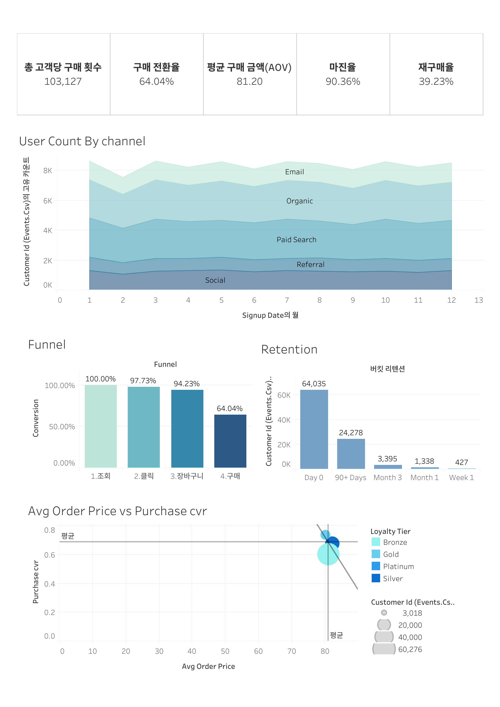

# E-commerce Marketing Analytics

## 1. 프로젝트 개요
이커머스 플랫폼 사용자 행동/마케팅 데이터를 기반으로 유입부터 구매까지 전환 흐름을 시각화한 대시보드입니다.
유입 채널 성과, 퍼널 단계별 전환율, 리텐션, 매출 및 마진, 로열티 등급별 성과를 한 화면에서 빠르게 점검하는 것을 목표로 했습니다. 

## 2. 대시보드
- Acquisition: 유입 채널별 유입 사용자 수 비교 및 날짜별 유입 트렌드 확인 
- Activation: 이벤트 기반 퍼널 정의, 단계별 전환율 계산 및 퍼널 차트로 이탈 구간 확인  
- Retention: 첫 구매 기준 재구매 여부로 리텐션 정의, 리텐션 커브로 재방문/재구매 지속성 확인  
- Revenue: 환불 제외 조건에서 브랜드별 마진율 비교로 수익 기여 브랜드 파악 
- Loyalty: 로열티 등급별 고객 특성 비교(평균 주문 금액, 평균 구매 전환율, 고객 수)로 충성 고객 영향 확인  
- KPI: 핵심 지표 5개를 카드로 요약하여 전체 퍼널 상태를 한눈에 모니터링 

## 3. 구성
워크시트 5개 + 대시보드 1개로 구성했습니다.  

- Worksheet 1: Acquisition (유입 분석)
  - 채널별 유입 사용자 수 비교 (영역 차트 활용)
  - 날짜별 유입 사용자 수 추세 파악 (라인 차트 활용)

- Worksheet 2: Activation (퍼널 분석)
  - event_type 기반 퍼널 정의
  - 퍼널 차트로 단계별 규모 비교
  - 계산된 필드 생성 (Conversion)

- Worksheet 3: Retention (리텐션 분석)
  - 첫 구매 시점 기준 재구매 여부로 리텐션 정의
  - 막대 차트 활용

- Worksheet 4: Loyalty (충성도 분석)
  - 충성도 등급별 구매 전환율 버블 차트
  - X: 평균 주문 금액, Y: 평균 구매 전환율
  - 버블 크기: 전체 고객 수
  - 평균선 + 추세선 포함

- Worksheet 5: KPI Cards
  - 총 유입 사용자 수
  - 구매 전환율 (%)
  - 평균 주문 금액(AOV)
  - 마진율 (%)
  - 재구매율 (%)

## 4. 대시보드 레이아웃 및 인터랙션
- 레이아웃: 세로형(스크롤 가능한 구조)  
- 상단(Header): KPI 요약 카드  
- 중앙/하단: 워크시트 1~4 요약 시각화 
- 좌측: 필터 패널(날짜, 로열티 등급)
- 
## 5. 배포 및 공유 방식
GitHub 에서는 대시보드가 실행되지 않기 때문에, 아래 링크에 들어가면 동적 대시보드를 확인할 수 있습니다.

Tableau Public link
- https://public.tableau.com/app/profile/moonyeong.cho/viz/MarketingE-CommerceDashboard2/1

## 6. 결과 스크린샷
- assets/dashboard_overview.png
- assets/ws1_acquisition.png
- assets/ws2_activation.png
- assets/ws3_retention.png
- assets/ws4_loyalty.png
- assets/ws5_kpi.png

README에 이미지 표시 예시:

## 7. 파일 안내
- /assets/ : 대시보드 및 워크시트 스크린샷
- /tableau/ : 태블로 twbx 파일
- (/docs/ : 지표 정의 및 계산식 정리)

## 8. 데이터
- Marketing & E-Commerce Analytics Dataset (Kaggle)
  (sediment://file_000000003e88720b8d9a0aaf9e70b23f)
